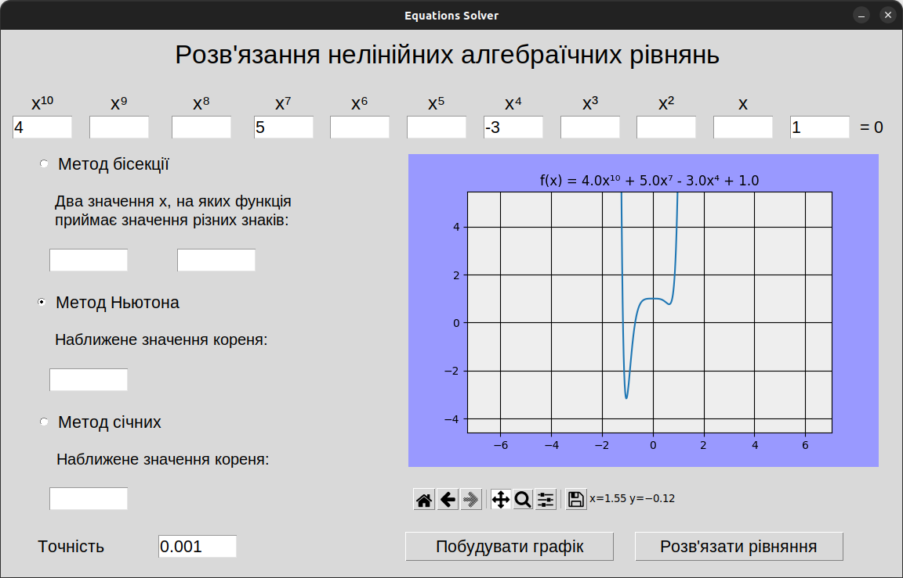

# Non-linear algebraic equations solver

## Table of Contents
* [General Info](#general-information)
* [Technologies Used](#technologies-used)
* [Features](#features)
* [Screenshots](#screenshots)
* [Setup](#setup)
* [Usage](#usage)


## General Information
- Program solves non-linear algebraic equations by three different methods: the secant method, method of bisections and Newton's method
- The goal of the project is to help solve equations and check yourself

## Technologies Used
- Python - version 3.9
- Numpy - version 1.23.0
- Tkinter - version 0.1.0
- Matplotlib - version 3.6.1


## Features:
- Program can graph the function
- Polynomail degree up to 10
- Error handling


## Screenshots



## Setup
Use requirements.txt file and virtual environment (optionally)

`pip install -r requirements.txt`


## Usage
After installation change directory to `src/` and run `main.py`

```
$ cd src/
$ python3 ./main.py
```

